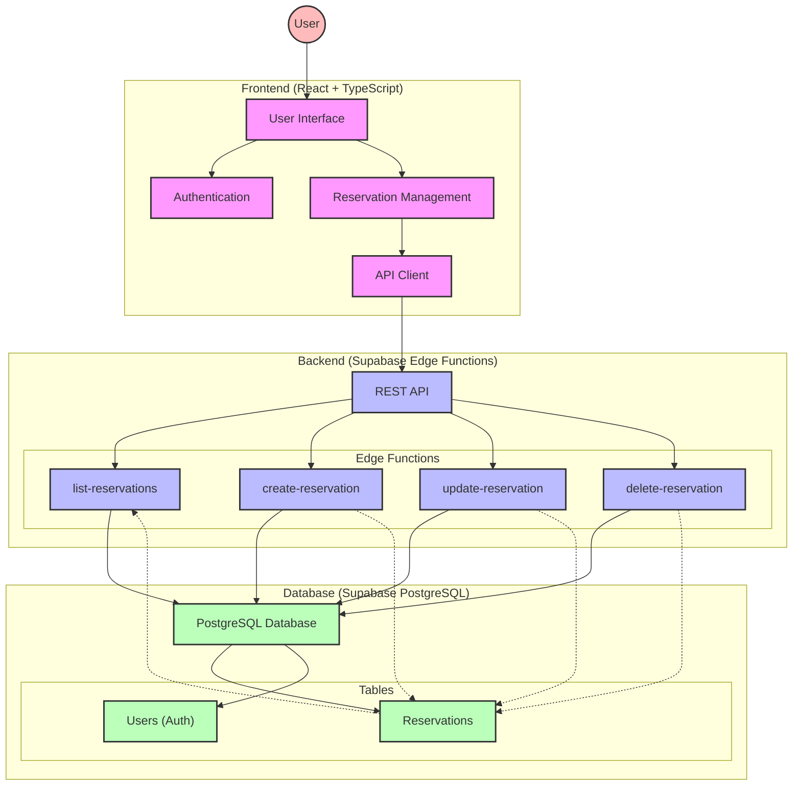

```mermaid
graph TB
    %% Main Components
    subgraph "Frontend (React + TypeScript)"
        UI["User Interface"]
        Auth["Authentication"]
        ReservationMgmt["Reservation Management"]
        API_Client["API Client"]
    end

    subgraph "Backend (Supabase Edge Functions)"
        API["REST API"]
        subgraph "Edge Functions"
            ListReservations["list-reservations"]
            CreateReservation["create-reservation"]
            UpdateReservation["update-reservation"]
            DeleteReservation["delete-reservation"]
        end
    end

    subgraph "Database (Supabase PostgreSQL)"
        DB["PostgreSQL Database"]
        subgraph "Tables"
            ReservationsTable["Reservations"]
            UsersTable["Users (Auth)"]
        end
    end

    %% Connections
    UI --> Auth
    UI --> ReservationMgmt
    ReservationMgmt --> API_Client
    API_Client --> API
    
    API --> ListReservations
    API --> CreateReservation
    API --> UpdateReservation
    API --> DeleteReservation
    
    ListReservations --> DB
    CreateReservation --> DB
    UpdateReservation --> DB
    DeleteReservation --> DB
    
    DB --> ReservationsTable
    DB --> UsersTable

    %% Data Flow
    User((User)) --> UI
    ReservationsTable -.-> ListReservations
    CreateReservation -.-> ReservationsTable
    UpdateReservation -.-> ReservationsTable
    DeleteReservation -.-> ReservationsTable

    %% Styling
    classDef frontend fill:#f9f,stroke:#333,stroke-width:2px
    classDef backend fill:#bbf,stroke:#333,stroke-width:2px
    classDef database fill:#bfb,stroke:#333,stroke-width:2px
    classDef user fill:#fbb,stroke:#333,stroke-width:2px
    
    class UI,Auth,ReservationMgmt,API_Client frontend
    class API,ListReservations,CreateReservation,UpdateReservation,DeleteReservation backend
    class DB,ReservationsTable,UsersTable database
    class User user
``` 