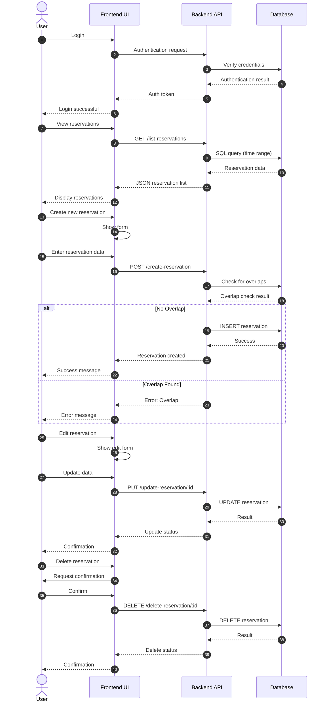

```mermaid
sequenceDiagram
    autonumber
    actor User
    participant UI as Frontend UI
    participant API as Backend API
    participant DB as Database
    
    %% Authentication
    User->>UI: Login
    UI->>API: Authentication request
    API->>DB: Verify credentials
    DB-->>API: Authentication result
    API-->>UI: Auth token
    UI-->>User: Login successful
    
    %% View Reservations
    User->>UI: View reservations
    UI->>API: GET /list-reservations
    API->>DB: SQL query (time range)
    DB-->>API: Reservation data
    API-->>UI: JSON reservation list
    UI-->>User: Display reservations
    
    %% Create New Reservation
    User->>UI: Create new reservation
    UI->>UI: Show form
    User->>UI: Enter reservation data
    UI->>API: POST /create-reservation
    API->>DB: Check for overlaps
    DB-->>API: Overlap check result
    
    alt No Overlap
        API->>DB: INSERT reservation
        DB-->>API: Success
        API-->>UI: Reservation created
        UI-->>User: Success message
    else Overlap Found
        API-->>UI: Error: Overlap
        UI-->>User: Error message
    end
    
    %% Edit Reservation
    User->>UI: Edit reservation
    UI->>UI: Show edit form
    User->>UI: Update data
    UI->>API: PUT /update-reservation/:id
    API->>DB: UPDATE reservation
    DB-->>API: Result
    API-->>UI: Update status
    UI-->>User: Confirmation
    
    %% Delete Reservation
    User->>UI: Delete reservation
    UI->>User: Request confirmation
    User->>UI: Confirm
    UI->>API: DELETE /delete-reservation/:id
    API->>DB: DELETE reservation
    DB-->>API: Result
    API-->>UI: Delete status
    UI-->>User: Confirmation
``` 